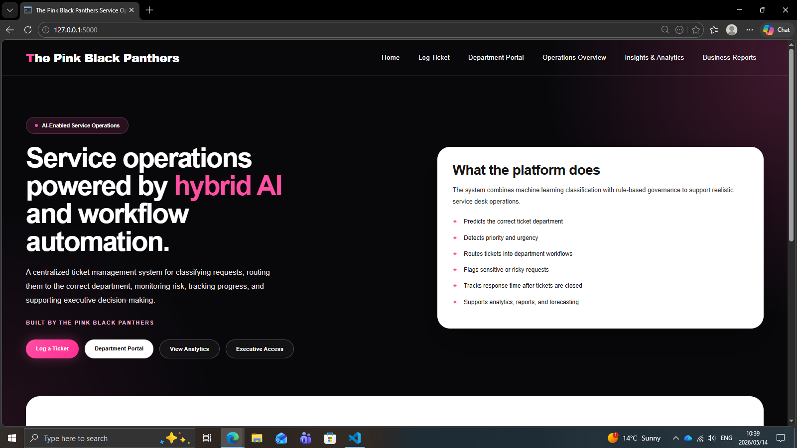
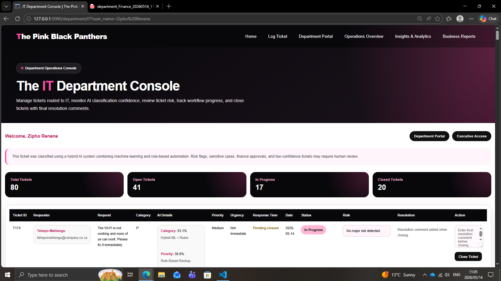
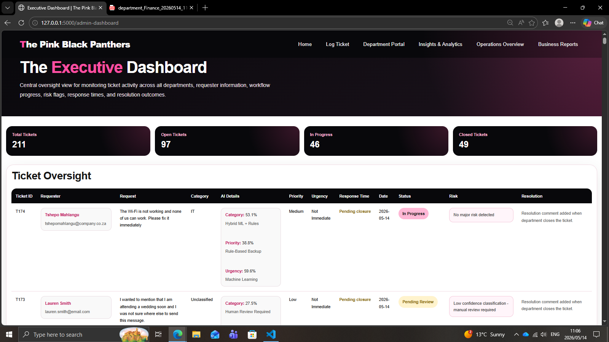
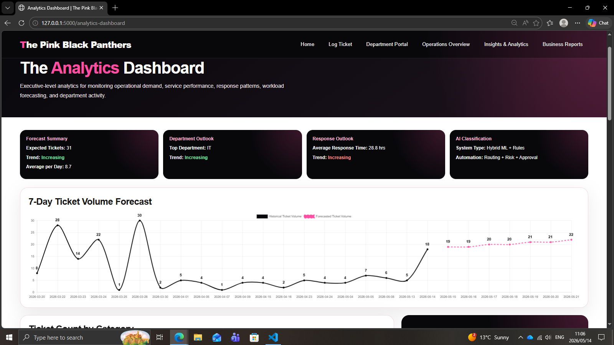
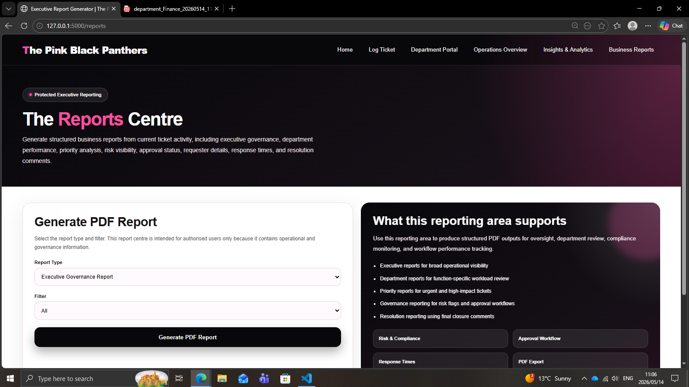

# AI-Powered Ticket Classification & Service Operations Platform

## Overview

The Pink Black Panthers Service Operations Platform is a hybrid AI-powered ticket management system designed to simulate realistic enterprise service desk operations.

The platform combines machine learning classification, rule-based governance logic, department routing workflows, risk management, executive dashboards, analytics, forecasting, and PDF report generation.

## Key Features

- Hybrid AI ticket classification
- ML confidence scoring
- Department routing
- Priority and urgency detection
- Risk and governance workflows
- Department dashboards
- Executive dashboard
- Analytics and forecasting
- Response-time tracking
- PDF report generation

## Tech Stack

- Python
- Flask
- pandas
- SQLite
- scikit-learn
- joblib
- HTML
- CSS
- JavaScript
- Chart.js
- ReportLab

## How It Works

1. A user submits a ticket.
2. The ML model predicts the ticket category.
3. Rule-based logic determines priority, urgency, risk flags, and human review requirements.
4. The ticket is routed to the correct department.
5. Department users process the ticket.
6. Response time is generated after the ticket is closed.
7. Dashboards and reports update automatically.

## Machine Learning

The system uses supervised machine learning for ticket category prediction.

- TF-IDF Vectorization converts ticket text into numerical features.
- Logistic Regression predicts the most likely department.
- The system records ML confidence for transparency.

Categories:

- IT
- HR
- Finance
- Operations

Example:

```text
Input: There is a fraudulent payment on my account urgently
Prediction: Finance
Confidence: 71.7%

## Screenshots

### Homepage


### Department Dashboard


### Executive Dashboard


### Analytics Dashboard


### Reports Page
