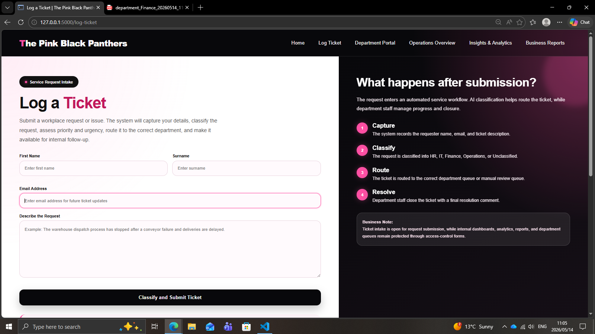
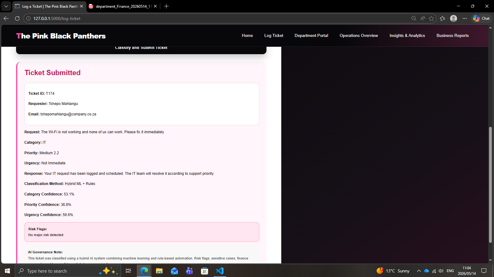

# AI-Powered Business Operations Assistant

## Overview

The Pink Black Panthers Business Operations Assistant is a hybrid AI-powered ticket management and workflow platform designed to simulate realistic enterprise service desk operations.

The platform combines machine learning classification, rule-based governance logic, department routing workflows, risk management, executive oversight, analytics, forecasting, and PDF report generation.

---

## Key Features

- Hybrid AI ticket classification
- ML confidence scoring
- Department routing workflows
- Priority and urgency detection
- Risk and governance workflows
- Human review handling
- Department dashboards
- Executive oversight dashboard
- Analytics and predictive insights
- Response-time tracking
- Resolution comments
- PDF report generation

---

## Tech Stack

- Python
- Flask
- pandas
- SQLite
- scikit-learn
- joblib
- HTML
- CSS
- JavaScript
- Chart.js
- ReportLab

---

## How It Works

1. A user submits a ticket.
2. The ML model predicts the ticket category.
3. Rule-based logic determines priority, urgency, risk flags, and human review requirements.
4. The ticket is routed to the correct department.
5. Department users process the ticket.
6. Response time is generated after ticket closure.
7. Dashboards and reports update automatically.

---

## Machine Learning

The system uses supervised machine learning for ticket category prediction.

### AI Components

- TF-IDF Vectorization converts ticket text into numerical features.
- Logistic Regression predicts the most likely department.
- ML confidence scores improve transparency.
- Rule-based backup logic improves governance and reliability.

### Supported Categories

- IT
- HR
- Finance
- Operations

### Example Prediction

```text
Input:
There is a fraudulent payment on my account urgently

Prediction:
Finance

Confidence:
71.7%
```

---

## Governance & Human Oversight

The platform avoids fully autonomous AI decision-making.

Instead, the system uses:

- Human review workflows
- Governance visibility
- Risk monitoring
- Confidence thresholds
- Executive oversight

This demonstrates responsible AI principles in operational environments.

---

## Dashboards & Reporting

### Department Console

Department staff can:

- Start tickets
- Process workflows
- Close tickets
- Add final resolution comments

### Operations Overview

Executives can monitor:

- Ticket volumes
- Operational performance
- Response times
- Risk visibility
- AI confidence
- Resolution outcomes

### Insights & Analytics

The analytics dashboard includes:

- Ticket trends
- Category analysis
- Priority analysis
- Response-time tracking
- Predictive insights

### Business Reports

The reporting module generates PDF operational reports using ReportLab.

---

## Screenshots

### Homepage


### Log Ticket



### Ticket Submission



### Department Dashboard


### Executive Dashboard


### Analytics Dashboard


### Reports Page


---

## Future Improvements

Potential future enhancements include:

- Email notifications
- Real-time alerts
- SLA tracking
- Cloud deployment
- Assigned ticket ownership
- Advanced predictive AI
- Role-based permissions

---

## Conclusion

The AI-Powered Business Operations Assistant evolved from a simple ticket classifier into a multi-role enterprise workflow platform incorporating:

- AI-assisted decision support
- Operational automation
- Human oversight
- Governance visibility
- Predictive insights
- Analytics and reporting

The project demonstrates both technical implementation skills and enterprise system design thinking.